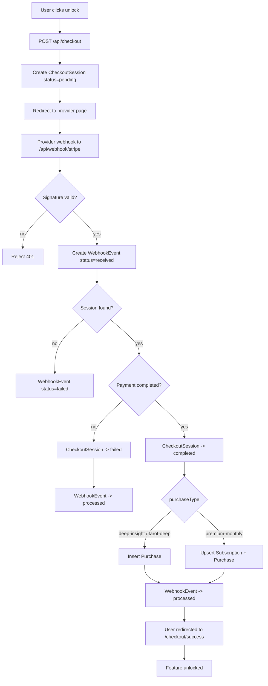

# Payments Flow Diagram

## Reconcile Job

- Endpoint: `POST /api/cron/reconcile-checkout`
- Purpose: convert stale `pending` sessions to `failed` if older than 30 minutes.
- Trigger: cron every 15 minutes.

